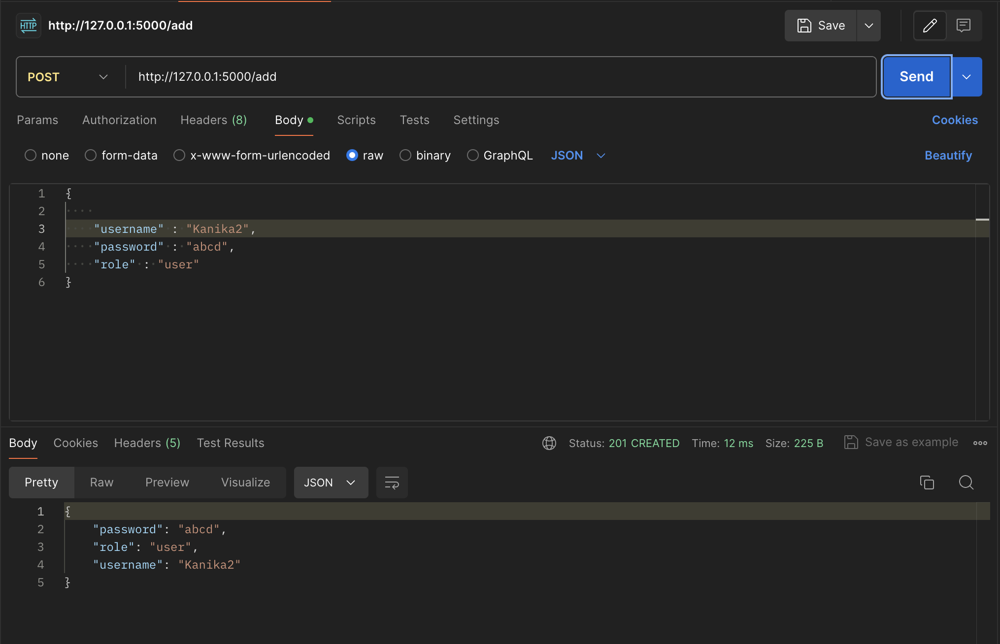
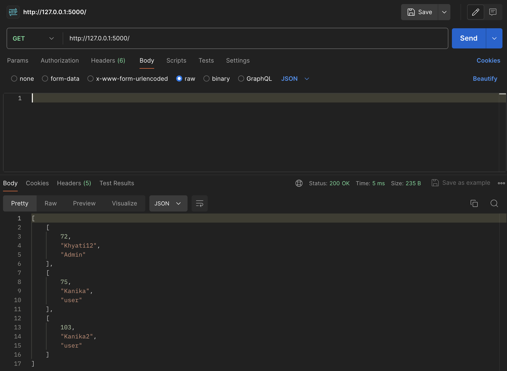
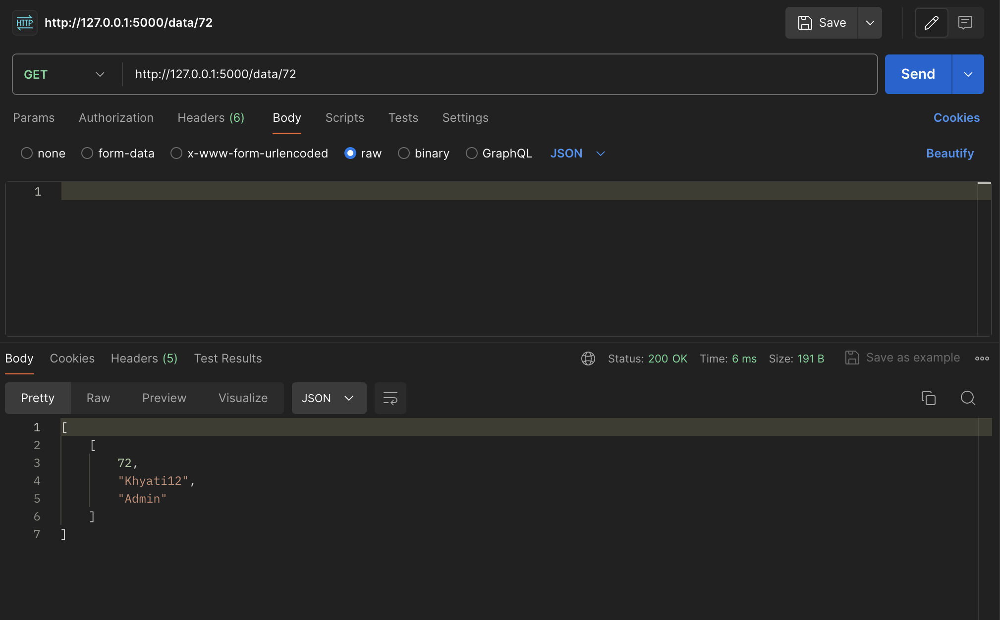
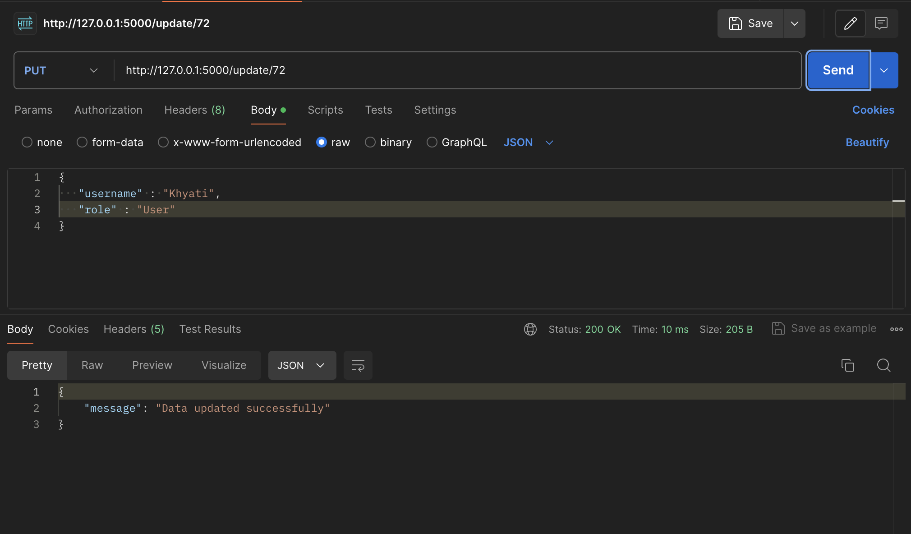
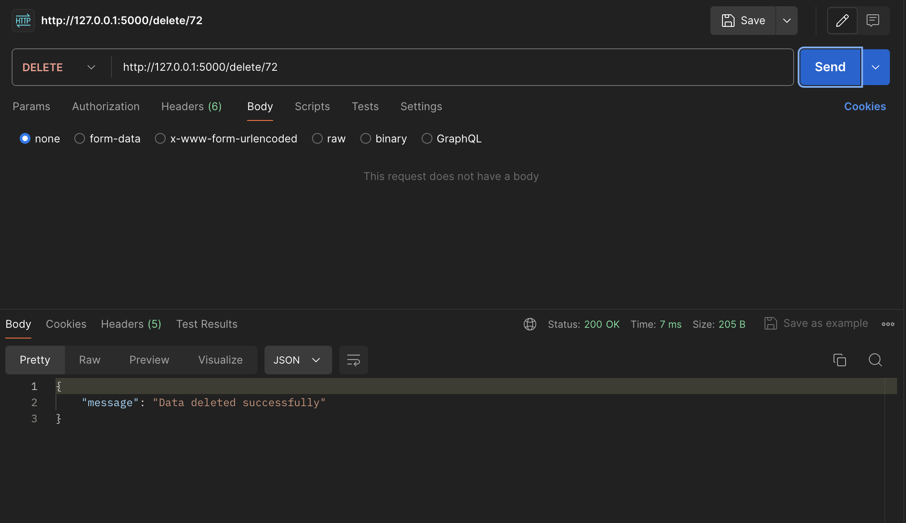

# Flask crud app :

This application is built using flask and allows to manage users in a database. It allows to add new users, get details of all users,get info of a particular user, update existing users and delete users.

## Features:

1. Add User :
  
   **Endpoint** : '/add' 
   **Method** : POST

   

2. Get All Users : 
   
   **Endpoint** : '/'  
   **Method** : GET

   

3. Get user with specific id : 
   **Endpoint** : '/data/{id}'  
   **Method** : GET

   

4. Update User : 
   **Endpoint** : '/update/{id}'  
   **Method** : PUT

   

5. Delete User :
    **Endpoint** : '/delete/{id}'  
    **Method** : DELETE

    

